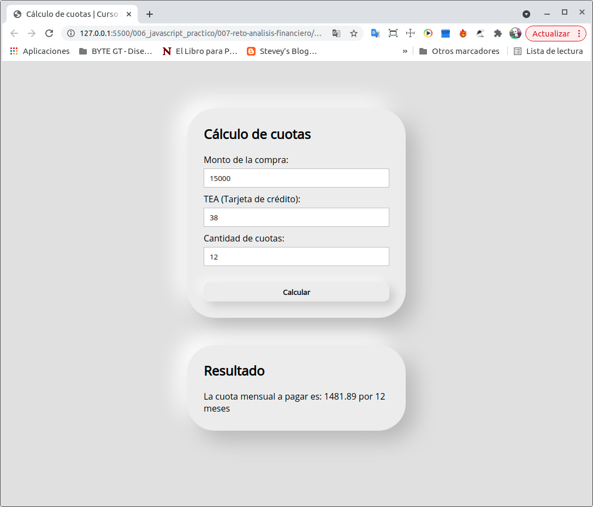

# Curso práctico de JavaScript

## Taller #1: Figuras geométricas

- 1️⃣ Primer paso: Definir las fórmulas
- 2️⃣ Segundo paso: Implementar las fórmulas en JavaScript
- 3️⃣ Tercer paso: Crear funciones
- 4️⃣ Cuarto paso: Integrar JavaScript con HTML

## Taller #2: Porcentajes y descuentos

- 1️⃣ Primer paso: Definir las fórmulas
- 2️⃣ Segundo paso: Implementar las fórmulas en JS
- 3️⃣ Tercer paso: Crear funciones para encapsular el cálculo del descuento
- 4️⃣ Cuarto paso: Integrar JavaScript con HTML

## Taller #3: Media, Mediana y moda

- 1️⃣ Primer paso: Definir las fórmulas
- 2️⃣ Segundo paso: Implementar las fórmulas en JS
- 3️⃣ Tercer paso: Crear funciones para encapsular el cálculo de la media, mediana y moda.
- 4️⃣ Cuarto paso: Integrar JavaScript con HTML

## Reto

